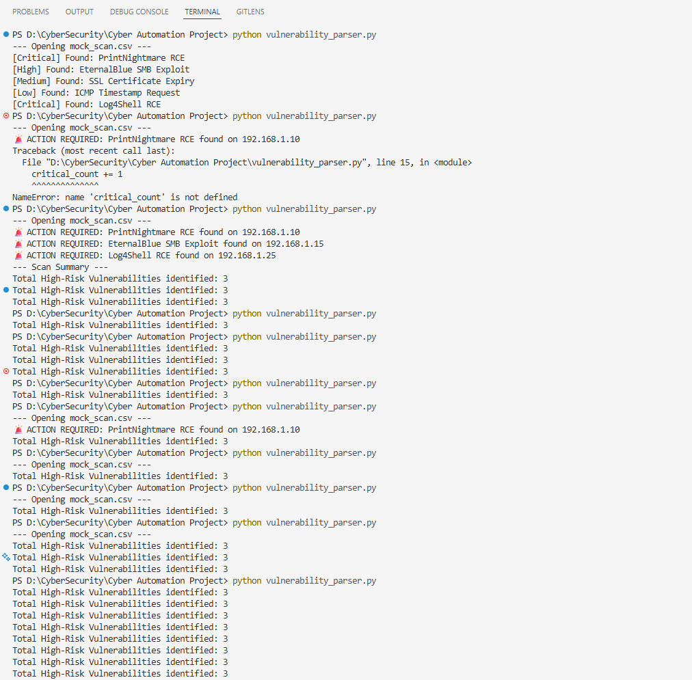
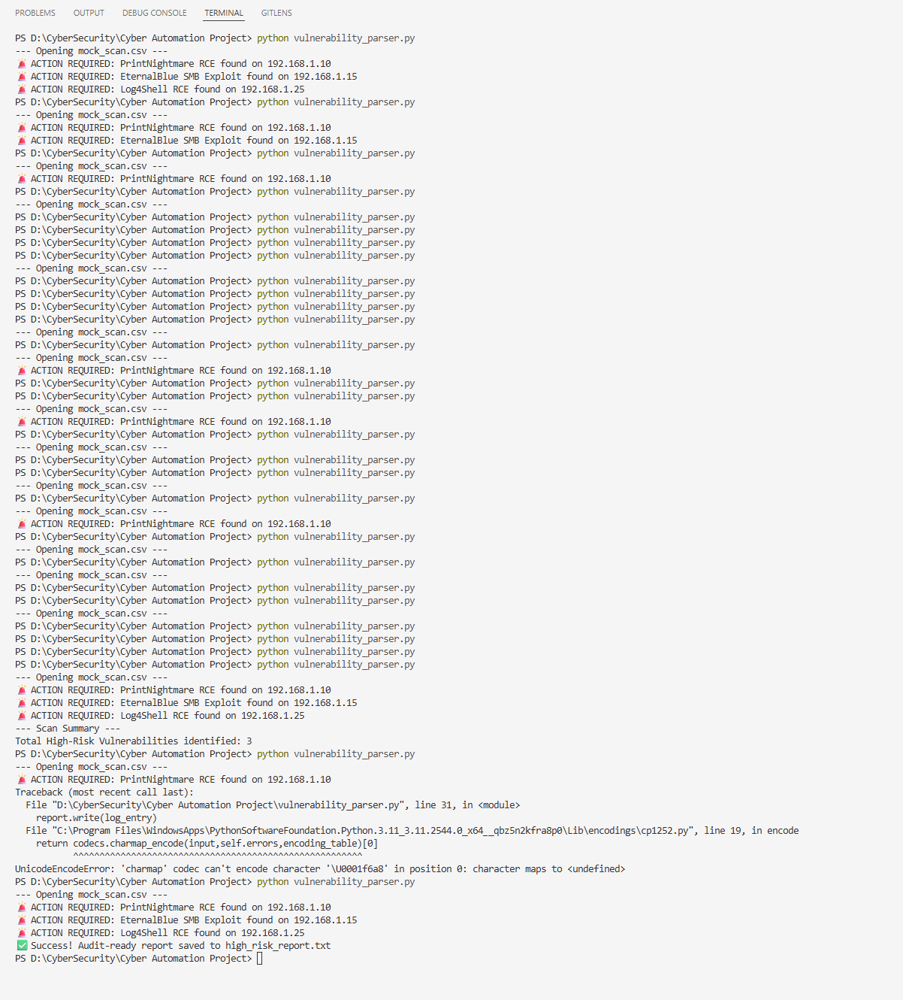

# Nessus Vulnerability Parser (VSCode Python Automation)

## 📋 Project Overview
Implement a automated risk report generator in VSCode using Python. The Python tool acts as a **Middleware Parser** to automatically filter through the Low/Medium risks and extract ONLY the **Critical and High-priority** vulnerabilities into an audit-ready risk report.

## 🎯 What it solves
Fixes what security analysts call "Information Overload." Instead of manually searching through scan data, it is time efficient and reduces human error.

## 🛠️ Features & Technical Implementation
* **Data Extraction:** Utilizes Python's `csv` library and `DictReader` to parse structured scan data.
* **Logical Filtering:** Implements conditional logic to isolate high-risk targets based on the "Severity" column.
* **Automated Reporting:** Generates a formatted `.txt` report including:
    * Formatted header and footer.
    * Dynamic **Timestamps** for when report is generated.
    * Summary of total high-risk findings.
* **Cross-Platform Support:** Implemented `UTF-8` encoding to ensure security emojis and special characters render correctly on Windows, Mac, and Linux.

## 📂 Project Structure
* `vulnerability_parser.py`: The core automation script.
* `mock_scan.csv`: Fake dataset mirroring a standard Nessus export.
* `high_risk_report.txt`: The filtered report generated by the script.

## 📸 Evidence of Execution
Below is the terminal history showing the resolution of a few errors (`NameError`) and encoding conflicts (`UnicodeEncodeError`).




## 🚀 How to Run
1. Ensure Python 3.x is installed.
2. Place your Nessus export (`mock_scan.csv`) in the project directory.
3. Run the script:
   ```bash
   python vulnerability_parser.py
